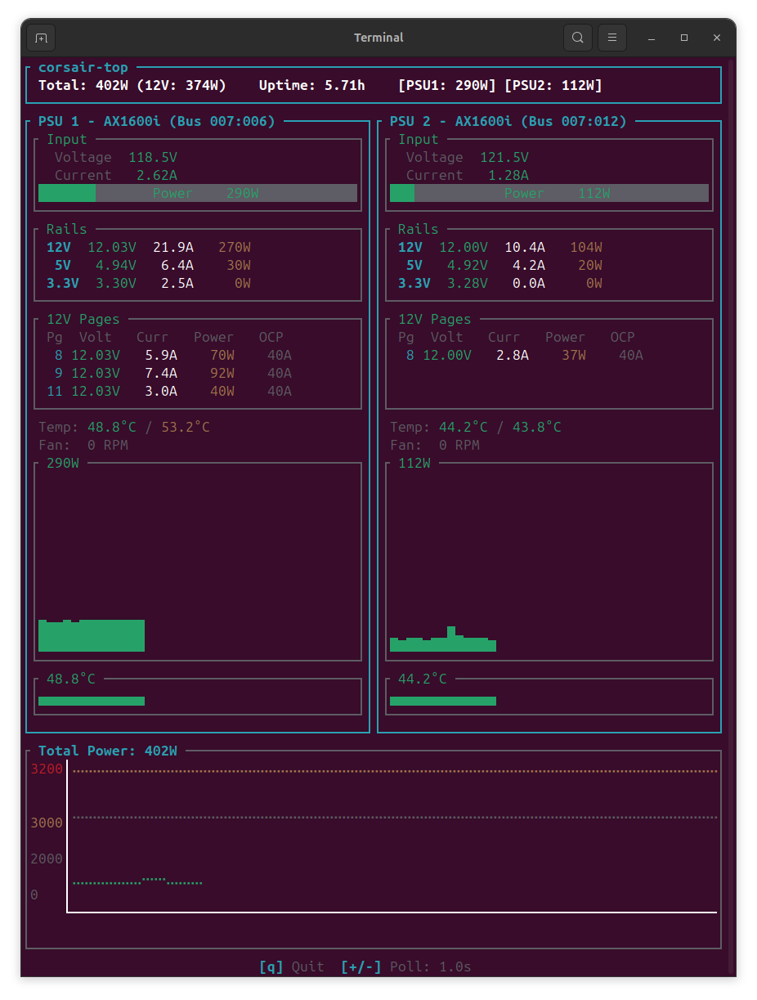

# corsair-top-ax1500i

Real-time TUI monitor for the Corsair **AX1500i** power supply.

This project is a hard fork of [rgilbreth/corsair-top](https://github.com/rgilbreth/corsair-top) (originally targeting the AX1600i) ported to the AX1500i. **It is AX1500i-only** and does not work on the AX1600i — the two PSUs share the "Corsair Link USB Dongle" branding but use different USB silicon, different wire framing, different transport, and a partly different register map. Restoring AX1600i support would require runtime model dispatch across all of those layers; if you need AX1600i, use the upstream project unmodified.

The Rust crate name is still `corsair-top` (binary: `corsair-top`) for minimal diff against upstream — only the project / repo name and documentation reflect the AX1500i scope.



## What's different from upstream

The AX1500i (USB ID `1b1c:1c02`) and AX1600i (`1b1c:1c11`) look superficially similar but diverge at every layer below the PMBus register map:

| Layer            | Upstream (AX1600i)                          | This fork (AX1500i)                                                |
| ---------------- | ------------------------------------------- | ------------------------------------------------------------------ |
| USB transport    | libusb bulk endpoints `0x82` / `0x02`       | Kernel `cp210x` serial driver, `/dev/ttyUSB0` at 115200 8N1        |
| Bridge silicon   | (assumed Cypress)                           | Silicon Labs C8051F32x running USBXpress firmware                  |
| Wire framing     | Bulk + custom encoding + extra `[0x12]` step | Serial, cpsumon-style framing, no `[0x12]` step                    |
| Init sequence    | One vendor control transfer                 | None — kernel `cp210x` driver handles the bridge init              |
| Input power      | Read directly from register `0xee`          | Read register `0x97` then average with V×I (matches `cpsumon`)     |
| Output power     | Not displayed                               | Computed via the AX1500i calibration formula                       |
| Cable type       | N/A                                         | Reads register `0xf2` (15A vs 20A connector)                       |
| Fan mode         | N/A                                         | Reads register `0xf0` (Auto / Fixed)                               |
| Efficiency       | N/A                                         | Computed from output/input                                         |

The protocol details came from reverse-engineering [`ka87/cpsumon`](https://github.com/ka87/cpsumon) and the [bleepitybloopity AXi blog post](https://bleepitybloopity.com/posts/corsairaxi/). The Silicon Labs bridge speaks a CP210x-compatible vendor protocol, which is why the in-tree kernel `cp210x` driver works against it once told to claim the AX1500i's USB IDs.

## Features

- Live input **and** output voltage, current, power
- Calibrated efficiency display
- Per-rail breakdown (12V, 5V, 3.3V)
- 12V virtual-page (PCIe) current / power / OCP limit monitoring
- Cable type detection (15A vs 20A — AX1500i specific)
- Fan mode (Auto vs Fixed)
- Temperature and fan-speed display
- Per-PSU power and temperature sparkline graphs
- Combined total-power chart with **two lines**: input (green) and output (cyan)
- Multi-PSU support with aligned panel layout
- Adjustable polling rate

## Requirements

- Linux
- Rust toolchain (1.70+)
- `libudev` headers (`libudev-dev` on Debian, included in `systemd` on Arch)
- `pkg-config`
- Corsair AX1500i PSU connected via the built-in Corsair Link USB dongle

## Install

```bash
git clone https://github.com/janost/corsair-top-ax1500i.git
cd corsair-top-ax1500i
cargo build --release
sudo install -m 755 target/release/corsair-top /usr/local/bin/
```

(The original `install.sh` is for upstream and creates a libusb-style udev rule — it's not needed here. The AX1500i is exposed via `/dev/ttyUSB*`, not as a raw USB device.)

## Making it work — the cp210x bind

This is the **most important caveat**: the kernel `cp210x` driver does not include `1b1c:1c02` in its built-in device table, so plugging in the AX1500i does **not** automatically create `/dev/ttyUSB0`. You have to tell the driver to claim it.

### One-time per boot

```bash
sudo modprobe cp210x
echo "1b1c 1c02" | sudo tee /sys/bus/usb-serial/drivers/cp210x/new_id
```

After this, `/dev/ttyUSB0` (or `/dev/ttyUSBn`) appears and `corsair-top` can talk to the PSU. Verify with:

```bash
ls -l /dev/ttyUSB*
dmesg | tail
```

The `dmesg` output should show something like:

```
cp210x 1-X.Y:1.0: cp210x converter detected
usb 1-X.Y: cp210x converter now attached to ttyUSB0
```

### Persistent setup (recommended)

Create `/etc/modules-load.d/cp210x-corsair.conf` to autoload the driver:

```
cp210x
```

Create a udev rule at `/etc/udev/rules.d/99-corsair-ax1500i.rules` to bind the IDs automatically on plug-in:

```
ACTION=="add", SUBSYSTEM=="usb", ATTR{idVendor}=="1b1c", ATTR{idProduct}=="1c02", \
  RUN+="/bin/sh -c 'echo 1b1c 1c02 > /sys/bus/usb-serial/drivers/cp210x/new_id'"

# Optional: let users in the `uucp` group access the port without sudo
ACTION=="add", SUBSYSTEM=="tty", ATTRS{idVendor}=="1b1c", ATTRS{idProduct}=="1c02", \
  GROUP="uucp", MODE="0660"

# Optional: tell ModemManager to leave the device alone
ACTION=="add", SUBSYSTEM=="tty", ATTRS{idVendor}=="1b1c", ATTRS{idProduct}=="1c02", \
  ENV{ID_MM_DEVICE_IGNORE}="1"
```

Then reload udev and replug the dongle:

```bash
sudo udevadm control --reload-rules
sudo udevadm trigger
```

If you added yourself to `uucp`, log out and back in:

```bash
sudo usermod -aG uucp $USER
```

## Usage

```bash
sudo corsair-top                    # default: /dev/ttyUSB0
sudo corsair-top /dev/ttyUSB1       # explicit path
sudo corsair-top /dev/ttyUSB0 /dev/ttyUSB1  # multiple PSUs
```

If you set up the udev permissions above, you can drop `sudo`.

### Controls

| Key         | Action                              |
| ----------- | ----------------------------------- |
| `q` / `Esc` | Quit                                |
| `+` / `=`   | Increase polling rate (min 250 ms)  |
| `-`         | Decrease polling rate (max 5 s)     |

## Known limitations & quirks

### 12V virtual page register can get stuck

The AX1500i's PMBus controller silently rejects writes to the 12V virtual-page register (`0xe7`) when the new value is *lower* than the current value. The same quirk hits `cpsumon` (it bails on the second consecutive run with `set_page (12v): set failed`). Because `corsair-top` is a long-running TUI rather than a single-shot CLI, the implication is:

- The first read cycle after launch enumerates all 12 virtual pages successfully (incrementing 0 → 11).
- On every subsequent cycle, the controller rejects the write that resets the page back to 0. The loop then proceeds with the page register stuck at 11, so the per-page current and power readings show the values for that one page only.
- Voltage and OCP-limit columns continue to look right because all PCIe pages share the same voltage and OCP setting.

The tool falls back to the previous-cycle reading for affected pages rather than zeroing them out, so you keep seeing the last-known good per-rail breakdown. This is a firmware-level limitation — short of issuing some still-unknown PMBus reset command, the workaround is to relaunch the tool periodically (or rebind the `cp210x` driver) for a fresh per-page snapshot.

### Some AX1600i-specific code paths

The original tool draws reference lines at 1000 W / 1500 W / 1600 W when it detects an AX1600i. On AX1500i these scale automatically based on the peak observed power, so the chart still looks reasonable but won't show the rated-load reference lines.

### "Slow startup" is normal

The first few seconds after launch are spent doing dozens of register reads to populate the initial state. The TUI appears blank during this time. Subsequent cycles are fast (~100 ms per full read).

### Output power formula is calibrated for AX1500i specifically

The output-power and efficiency calculations come straight from `cpsumon`'s AX1500i calibration constants. They're a piecewise linear fit to the real PSU efficiency curve — accurate at the load points where the fit was taken, less reliable at very low or very high load. At idle (~5% load) the calculated efficiency is ~50%, which is intentionally conservative; under real load it converges to the rated ~92% (80+ Titanium).

## Acknowledgements

- [`rgilbreth/corsair-top`](https://github.com/rgilbreth/corsair-top) — the original AX1600i TUI this fork is based on.
- [`ka87/cpsumon`](https://github.com/ka87/cpsumon) — the only known-working open-source AX1500i implementation. Every protocol detail in this fork was reverse-engineered from cpsumon's source.
- [bleepitybloopity AXi protocol writeup](https://bleepitybloopity.com/posts/corsairaxi/) — independent verification of the wire format.

## License

MIT
